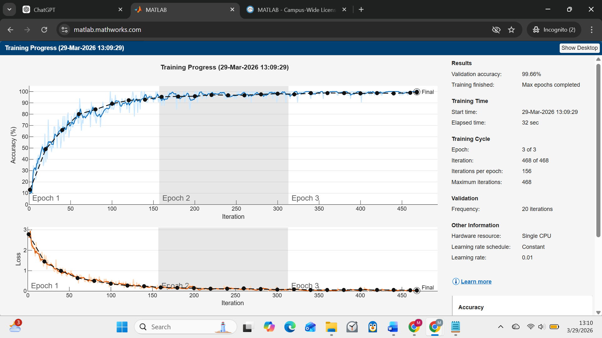

# CNN-Based Digit Classification (MATLAB)

## Overview

This project implements a Convolutional Neural Network (CNN) in MATLAB for handwritten digit classification using the MNIST dataset.

The model is trained using MATLAB’s Deep Learning Toolbox and demonstrates image classification using convolutional architectures.

---

## Features

* Convolutional Neural Network (CNN) implementation
* Training on MNIST dataset
* Validation during training
* Accuracy evaluation on test data
* Visualization of predictions

---

## Technologies Used

* MATLAB
* Deep Learning Toolbox

---

## Model Architecture

The CNN consists of multiple convolutional blocks:

* Convolution → Batch Normalization → ReLU
* Max Pooling layers for downsampling
* Fully connected layer for classification
* Softmax output layer

The architecture progressively extracts features from input images.

---

## Training Process

* Dataset: MNIST handwritten digits
* Optimizer: Stochastic Gradient Descent (SGDM)
* Epochs: 3
* Batch size: 32

The model is trained using both training and validation datasets.

---

## Results

* The model successfully classifies handwritten digits
* Achieves strong accuracy on test data
* Demonstrates feature extraction through deep convolution layers

---

## Accuracy

```text id="8qt7qr"
Test Accuracy: 99.66%

```

### Output

A detailed output of the MATLAB command line can be seen in `results/output.txt`

---

## Training Visualization

The model predicts and visualizes labels for random test images.



---

## Project Structure

```id="dyv2xy"
src/
 └── cnn_model.m
```

---

## How to Run

1. Open MATLAB
2. Run the script:

```matlab id="9i5xkm"
cnn_model
```

---

## Key Takeaways

* Understanding convolutional neural networks
* Practical experience with deep learning workflows
* Image classification using learned features
* Training and evaluating models using real datasets

---

## Author

Mehul Kapoor
